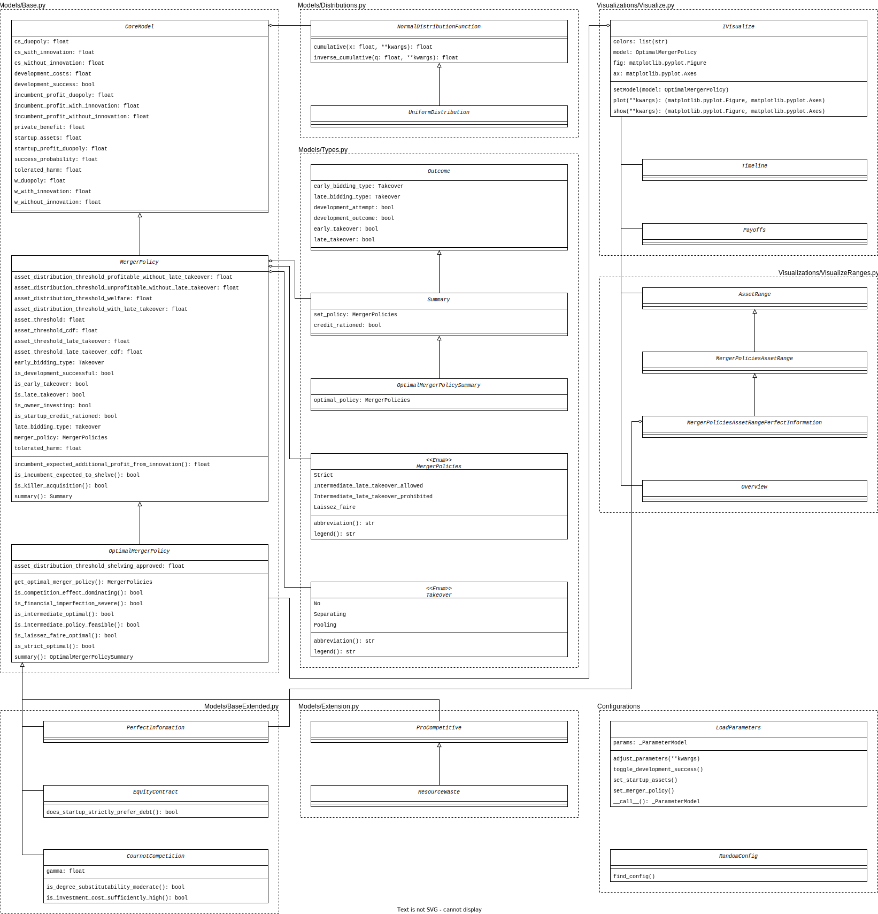

## Project Structure

Build the folder structure with the following command (or execute `assets/Structure/tree.sh`):

```bash
git config --global alias.tree '! git ls-tree --full-name --name-only -t -r HEAD | sed -e "s/[^-][^\/]*\//   |/g" -e "s/|\([^ ]\)/|-- \1/"'
git tree
```

This command just works for Git - repositories and not for folder structures in general.


This is the annotated folder structure:
```
.github
   |-- workflows
   |   |-- Black.yml  # checks the code style on errors
   |   |-- CodeCov.yml  # pushes the newest CI results to codecov.io
   |   |-- PyPI.yml  # pushes releases automatically on PyPI
   |   |-- codeql-analysis.yml  # checks for weaknesses in code
Fumagalli_Motta_Tarantino_2020  # package as published on PyPI
   |-- AdditionalModels.py  # MicroFoundationModel and PerfectInformationModel
   |-- Models.py  # BaseModel, MergerPolicy and OptimalMergerPolicy
   |-- Types.py  # Additional enums and dataclasses
   |-- Utilities.py  # useful classes for support in models
   |-- Visualize.py  # visualizations for the models
   |-- __init__.py
   |-- tests  # includes tests for the models and visualizations
   |   |-- MockModels.py
   |   |-- TestCases.md
   |   |-- Test_AdditionalModels.py
   |   |-- Test_Model.py
   |   |-- Test_Utilities.py
   |   |-- Test_Visualize.py
   |   |-- __init__.py
Notebooks
   |-- README.md  # introduction to the provided notebooks
   |-- __init__.py
   |-- test.ipynb
assets  # additional ressources regarding the code
   |-- Strucutre  # contains informations about the project and code structure
   |   |-- class_diagram.drawio  # UML class diagram
   |   |-- tree.sh  # generated this tree of the project structure
   |-- code style  # bash scripts for automatic check and enforcement of code style
   |   |-- check_black.sh
   |   |-- run_black.sh
   |-- visual  # contains graphics such as images and sketches
   |   |-- logo.svg
docs  # contains the files for the documentation page (automatically generated with pdoc)
   |-- build.sh  # bash script to execute build of documentation
CITATION.cff  # for citation of the repository
Fumagalli et al (2020) - Shelving or developing  # Original paper
README.md  # introduction to the package
LICENSE
requirements.txt  # needed dependcies for the package
setup.py  # setup script for publication on PyPI
```


## Class diagram

 (If the class diagram is not shown, follow this [link](https://github.com/manuelbieri/Fumagalli_2020/blob/master/assets/visual/class_diagram.svg))


## Code style

As default code style [Black](https://black.readthedocs.io/en/stable/the_black_code_style/current_style.html) is used and
automatically checked and enforced by GitHub - workflows.
